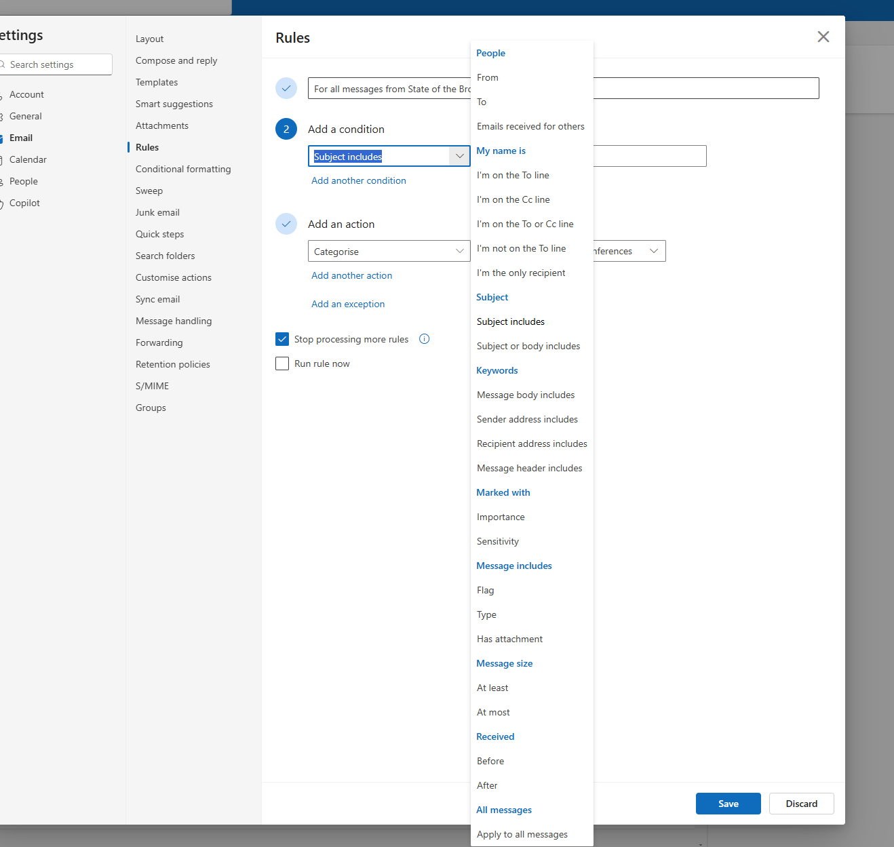
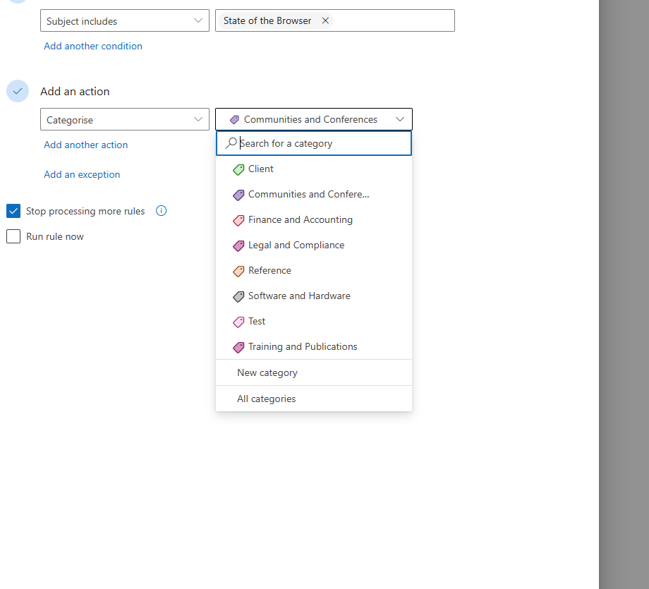

# Rules & Actions v2: Outlook-Inspired Conditions + Actions

> **Status:** PLANNED — no code written yet.
> **Supersedes:** `SECTION_BUILDER.md` (which defined the original action types).
> **Branch:** TBD — create from `main` after merging `feature/destination-picker-fixes`.

---

## Summary

Redesign the rules editor and transform pipeline using the Outlook Rules pattern:
- **Conditions** = IF (font size, color, position, text matching)
- **Action** = THEN (Section Title / Section Content / Exclude)
- **Format** = conditional sub-option when Action = Section Content (Paragraph, H1, H2, H3, Bullet List, Numbered List)

Also: collapse Extracted + Transformed tabs into one unified view, add "Area:" and "Section:" prefixes, and implement Option C (collapsed sections, expand-to-map heading/content separately).

See also: `CORE_CONCEPT.md` — the foundational principle that everything becomes Markdown, and actions are Markdown conversion instructions.

---

## The Outlook Rules Model

The rules editor follows Outlook's Rules pattern. A rule in Outlook has four parts, and ours maps directly:

### The Four Layers

| # | Outlook | UpDoc Equivalent |
|---|---------|-----------------|
| 1 | **Rule name** — "For all messages from PayPal" | **Role name** — "Tour Title", "Day Heading", "Section Body" |
| 2 | **Conditions** (IF) — "Sender address includes paypal.com" | **Conditions** (IF) — font size equals 28, font name contains Clarendon, color equals #FFFFFF |
| 3 | **Actions** (THEN) — "Categorise → Finance" | **Actions** (THEN) — Section Title / Section Content → Paragraph / Exclude |
| 4 | **Exceptions** (UNLESS) — "Unless subject includes newsletter" | **Exceptions** (UNLESS) — Unless text contains "Terms and Conditions" |

Plus two controls:
- **Stop processing more rules** → our first-match-wins behaviour (element claimed by one rule is excluded from later rules)
- **Run rule now** → our "re-run transform" / preview

### Conditions Are Pre-existing, Not User-Created

In Outlook, conditions come from a predefined categorized list — you pick from what the system knows about (People, Subject, Keywords, Message size, etc.). You don't invent your own condition types.

In UpDoc, the same applies. Conditions come from **what the source provides**:

| Source | Available Conditions | Richness |
|--------|---------------------|----------|
| **PDF** | Font size, font name, color, position (x/y), page number, bounding box | Richest — PdfPig extracts all visual metadata |
| **Word** | Style name (Heading 1, Normal, etc.), font properties | Medium — styles carry structure |
| **Web** | CSS selector, HTML element type, class name | Medium — DOM provides structure |
| **Markdown** | Heading level, code block, list type | Simplest — structure is already explicit |

The harder the source, the more conditions the user needs to define. The easier the source, the fewer conditions (possibly none).

### The Categorized Dropdown

Outlook groups conditions into categories with styled section headers:

```
Font                          (category header)
  Font size equals            (condition)
  Font size above
  Font size below
  Font name contains
  Font name equals
Color                         (category header)
  Color equals
Text                          (category header)
  Text begins with
  Text ends with
  Text contains
  Text matches pattern
Position                      (category header)
  Position is first
  Position is last
```

This grouped dropdown is visually clean. Implementation in Umbraco may require modern CSS (`<optgroup>` or CSS-styled dropdown). Worth investigating but not a blocker — a flat list works as a fallback.

### Key UX Insight: Rules Already Exist Before the User Starts

When PdfPig extracts a PDF, every element arrives with its metadata — font size, color, font name, position. Those metadata values ARE the conditions. **The rule already partially exists.** It just doesn't have a name or an action yet.

This means "Create Rule" is misleading. The user isn't creating a rule from nothing — they're **completing** a rule by:
1. Giving it a **name** (role) — "Tour Title"
2. Choosing an **action** — Section Title / Section Content / Exclude
3. Optionally choosing a **format** — Paragraph, Heading 2, Bullet List Item
4. Optionally adding **exceptions** — Unless text contains "NB:"

The conditions were already there the moment the content was extracted. The button should reflect this — something like "Define Rule" or "Assign Role" rather than "Create Rule".

### Exceptions (UNLESS)

Exceptions use the same condition vocabulary as conditions but act as negative filters. They enable single-rule expressions for cases we currently handle with separate `exclude` rules:

**Without exceptions (current):**
```
Rule 1: IF font=10, Helvetica, Black → THEN sectionContent
Rule 2: IF text contains "Terms and Conditions" → THEN exclude
Rule 3: IF text contains "NB:" → THEN exclude
```

**With exceptions:**
```
Rule 1: IF font=10, Helvetica, Black → THEN sectionContent
         UNLESS text contains "Terms and Conditions"
         UNLESS text contains "NB:"
```

Exceptions are a future enhancement — they simplify rule authoring but aren't required for the core pipeline to work. The current approach (separate exclude rules) achieves the same result.

---

## Naming Conventions (DECIDED)

Adopts Outlook's structural terminology directly. No translation needed between what a user knows from Outlook and what they see in UpDoc.

### Structural Terms

| Term | Definition | Outlook Equivalent |
|------|-----------|-------------------|
| **Rule** | A complete instruction: name + conditions + action + optional format + optional exceptions | Rule |
| **Condition** | An IF clause — matches element metadata (font size, color, text content) | Condition |
| **Action** | A THEN clause — declares what role this element plays | Action |
| **Format** | A sub-option of Action — which Markdown syntax to produce (only when Action = Section Content) | Second dropdown (e.g., Categorise → pick category) |
| **Exception** | An UNLESS clause — negative filter on conditions (future) | Exception |

### Action Values (Level 1)

Actions are **nouns** (role declarations), not verbs. The user is answering "what IS this element?" not "what should I DO with it?".

| JSON Value | UI Label | What It Does |
|-----------|----------|-------------|
| `sectionTitle` | Section Title | Starts a new section. Element text becomes the section heading. Flushes any open section. |
| `sectionContent` | Section Content | Accumulates within the current open section. Reveals the Format dropdown. |
| `exclude` | Exclude | Skip element entirely — not included in Markdown output. |

### Format Values (Level 2 — only when Action = Section Content)

Format values map directly to Markdown syntax. They come from the same vocabulary as Obsidian's Paragraph menu and every Markdown editor.

| JSON Value | UI Label | Markdown Output |
|-----------|----------|----------------|
| `paragraph` | Paragraph | `text` (plain) |
| `heading1` | Heading 1 | `# text` |
| `heading2` | Heading 2 | `## text` |
| `heading3` | Heading 3 | `### text` |
| `bulletListItem` | Bullet List | `- text` |
| `numberedListItem` | Numbered List | `1. text` (auto-numbered) |

Default format: `paragraph` (backward compatible with existing `addAsContent` rules).

### Condition Values

Conditions follow Outlook's descriptive phrase style. Grouped by category in the dropdown.

| JSON Value | UI Label | Category |
|-----------|----------|----------|
| `fontSizeEquals` | Font size equals | Font |
| `fontSizeAbove` | Font size above | Font |
| `fontSizeBelow` | Font size below | Font |
| `fontNameContains` | Font name contains | Font |
| `fontNameEquals` | Font name equals | Font |
| `colorEquals` | Color equals | Color |
| `textBeginsWith` | Text begins with | Text |
| `textEndsWith` | Text ends with | Text |
| `textContains` | Text contains | Text |
| `textEquals` | Text equals | Text |
| `textMatchesPattern` | Text matches pattern | Text |
| `positionFirst` | Position is first | Position |
| `positionLast` | Position is last | Position |

### UI Button Labels

| Current Label | New Label | Rationale |
|---|---|---|
| "Create Rule" | "Define Rule" | Conditions already exist from extraction. User is completing a rule, not creating from scratch. |
| "Edit Rules" | "Edit Rules" | No change — still correct when editing existing rules. |

### C# Property Names

```csharp
public class SectionRule
{
    public string Role { get; set; }        // User-defined name: "Tour Title"
    public string Action { get; set; }      // "sectionTitle" | "sectionContent" | "exclude"
    public string? Format { get; set; }     // "paragraph" | "heading1" | ... (null when Action != sectionContent)
    public List<RuleCondition> Conditions { get; set; }
    public List<RuleCondition>? Exceptions { get; set; }  // Future
}
```

### TypeScript Types

```typescript
export type RuleAction = 'sectionTitle' | 'sectionContent' | 'exclude';

export type ContentFormat =
    | 'paragraph'
    | 'heading1'
    | 'heading2'
    | 'heading3'
    | 'bulletListItem'
    | 'numberedListItem';

export interface SectionRule {
    role: string;
    action: RuleAction;
    format?: ContentFormat;
    conditions: RuleCondition[];
    exceptions?: RuleCondition[];  // Future
}
```

---

## Source Tab UI Vision: Rendered Markdown with Map Buttons

The Source tab should present the shaped content as **rendered Markdown** (like Obsidian's reading view), not as a data table or list of editors.

### Why Rendered Markdown

- The user's mental model is "I'm looking at a document" — headings, paragraphs, bullet lists flowing naturally
- The current Transformed view is a data table (section names, row counts, badges) — useful for administration but not how content authors think
- Rendered Markdown makes it immediately obvious what's a heading, what's body text, what's a bulleted list
- Map buttons sit in the margin next to each section — pick a section, map it to a CMS field

### Not Editable

Content is **reviewable, not editable** in the mapping view. Content editing happens in Umbraco after the document is created. UpDoc's job is extraction and mapping, not editing.

Considered putting content into Umbraco Markdown editors for inline editing — rejected because it would be a page full of separate editors with Map buttons, which is confusing. A rendered document view with Map buttons in the margin is cleaner.

### Areas Still Useful

The area groupings (Page Header, Organiser Information, Tour Details, Itinerary) with their colored bars are still useful as visual context. They provide the "where in the document am I?" framing around the rendered Markdown sections. Areas are the container; rendered Markdown is the content within.

---

## Key Decisions (Feb 2026 Session)

### 1. Two-Level Action Model (Outlook Pattern)

Inspired by Outlook's "Add a condition" / "Add an action" pattern where choosing an action like "Categorise" reveals a conditional second dropdown (pick which category).

**Level 1 — Action (what role does this element play?):**
| Action | What it does |
|--------|-------------|
| **Section Title** | Starts a new section. This element's text becomes the section title. Flushes any open section. |
| **Section Content** | Accumulates within the current open section. Reveals format dropdown. |
| **Exclude** | Skip element entirely. |

**Level 2 — Format (only when Action = Section Content):**
| Format | Markdown output | Example use |
|--------|----------------|-------------|
| Paragraph | `text` (plain) | Body text, descriptions |
| Heading 1 | `# text` | Major content headings |
| Heading 2 | `## text` | Day headings (Day 1, Day 2) |
| Heading 3 | `### text` | Sub-headings within content |
| Bullet List Item | `- text` | Feature bullet points |
| Numbered List Item | `1. text` (auto-numbered) | Step-by-step instructions |

**Default format:** Paragraph (backward compatible with existing `addAsContent` rules).

### 2. Renamed Actions (Old → New)

| Old action value | New action value | New UI label |
|-----------------|-----------------|--------------|
| `createSection` | `sectionTitle` | Section Title |
| `setAsHeading` | `sectionTitle` | Section Title (merged, was always the same) |
| `addAsContent` | `sectionContent` | Section Content |
| `addAsList` | `sectionContent` (format=`bulletListItem`) | Section Content → Bullet List Item |
| `exclude` | `exclude` | Exclude |

**New in code:** `format` property on `SectionRule` (optional, only meaningful when action = `sectionContent`).

### 3. JSON Schema Change

```json
{
  "role": "Day Heading",
  "action": "sectionContent",
  "format": "heading2",
  "conditions": [
    { "type": "fontSizeEquals", "value": 10 },
    { "type": "fontNameContains", "value": "HelveticaNeue-Medium" },
    { "type": "colorEquals", "value": "#16549D" }
  ]
}
```

```json
{
  "role": "Tour Title",
  "action": "sectionTitle",
  "conditions": [
    { "type": "fontSizeEquals", "value": 28 },
    { "type": "fontNameContains", "value": "Clarendon" }
  ]
}
```

Format values: `paragraph` (default), `heading1`, `heading2`, `heading3`, `bulletListItem`, `numberedListItem`.

### 4. Collapse Extracted + Transformed Tabs

**Decision:** Remove the Transformed tab. The Extracted tab's Composed Sections view IS the shaped output. Mapping happens directly from the Extracted tab.

**Rationale:**
- The action-driven grouping fix made the Composed Sections view show the same grouped sections as the Transformed tab
- Two tabs showing nearly the same data confuses users
- The Extracted view has richer data (area context, metadata, rule match info)
- The Three-Layer Pipeline (Extract → Shape → Map) is still three conceptual layers, but doesn't need three separate UI views

### 5. UI Hierarchy and Labelling

```
Page 1                                         2 sections, 3 areas
  Area: Page Header          [2 rules]    3 sections    [Edit Rules]
    Section: Organisation      "Art Fund Devon"                [Map]
    Section: Tour Title        "The Moorish Treasures..."      [Map]
    Section: Tour Description  "6 days from £1,649..."         [Map]

  Area: Tour Details         [2 rules]    5 sections    [Edit Rules]
    > Section: Features        • 4* hotels throughout...   [mapped badges] [expand]
    > Section: What We Will See  • Granada orientation...                  [expand]
    > Section: Optional          • Flamenco evening                        [expand]
    > Section: Accommodation     We stay two nights...                     [expand]
    > Section: Extras To Your Tour  • Single room supplement...            [expand]

  Area: Itinerary            [3 rules]    1 section     [Edit Rules]
    Section: Itinerary         ## Day 1 / We meet at...                    [Map]
```

**Prefixes:**
- "Area: {name}" — makes it clear this is an area grouping (yellow bar)
- "Section: {name}" — makes it clear this is a section within the area

### 6. Section Expand-to-Map (Option C Hybrid)

For sections that have both a title and content (Tour Details pattern):

**Collapsed (default):** Single row showing section name + content preview + mapping badges for both heading and content.

**Expanded (click chevron):** Reveals two separately-mappable sub-rows:
- **Section Title**: "Features" — [Map button]
- **Section Content**: "4* hotels throughout, 2 dinners included..." — [Map button]

Mapping badges on the collapsed row show at-a-glance status without expanding (e.g., `Features > Title` and `Features > Rich Text`).

For sections that are standalone (Page Header pattern — just content, no title/content split): Single row with one Map button. No expand needed.

### 7. Auto-Numbering for Numbered Lists

When format = `numberedListItem`, maintain a running counter:
- Increment for each consecutive `numberedListItem`
- Reset to 0 when any other format is encountered
- Output: `1. text`, `2. text`, `3. text`, etc.

### 8. User-Defined Role Names

Role names are user-defined, not a fixed list. "Organisation", "Tour Title", "Tour Description" are Tailored Travels concepts. Other sites would have completely different names.

The role name serves as:
- A label in the rules editor (identify which rule is which)
- For `sectionTitle`: the section name when mapped
- For `sectionContent`: a category label describing what kind of content this is

---

## Real-World Examples

### Page Header (standalone sections, each maps to a different property)

```
Rule 1: IF font=11.4, HelveticaNeue-Medium, #FFD200, positionFirst
         THEN action=sectionTitle, role="Organisation"

Rule 2: IF font=28, Clarendon, #FFFFFF
         THEN action=sectionTitle, role="Tour Title"

Rule 3: IF font=14.4, HelveticaNeue-Medium, #FFD200, positionLast
         THEN action=sectionTitle, role="Tour Description"
```

Result: 3 standalone sections. Each has one Map button → maps to a document property.

### Tour Details (title + content sections, each maps to block fields)

```
Rule 1: IF font=12, Clarendon, #16549D
         THEN action=sectionTitle, role="Section Title"

Rule 2: IF font=8.5, HelveticaNeue, #16549D
         THEN action=sectionContent, format=paragraph, role="Section Body"
```

Result: 5 sections (Features, What We Will See, Optional, Accommodation, Extras). Each expands to show title + content separately mappable.

### Itinerary (heading-within-content, all maps to one rich text field)

```
Rule 1: IF font=10, HelveticaNeue-Medium, #16549D
         THEN action=sectionContent, format=heading2, role="Day Heading"

Rule 2: IF font=10, HelveticaNeue, #221F1F
         THEN action=sectionContent, format=paragraph, role="Day Body"

Rule 3: IF font=8, HelveticaNeue-Medium, #16549D
         THEN action=sectionTitle, role="Notes"
```

Result: 1 section for itinerary content (## Day 1 + paragraphs + ## Day 2 + paragraphs...) plus 1 separate "Notes" section for the NB disclaimer. The itinerary section maps as one block to Suggested Itinerary rich text.

---

## Implementation Plan

### Phase 1: Data Model Changes

**C# — `SectionRules.cs`:**
- Add `Format` property to `SectionRule` (optional string, default null)
- Rename action values: `createSection` → `sectionTitle`, `addAsContent` → `sectionContent`, etc.
- Keep backward-compatible reading (old values still work)

**TypeScript — `workflow.types.ts`:**
- Update `RuleAction` type: `'sectionTitle' | 'sectionContent' | 'exclude'`
- Add `ContentFormat` type: `'paragraph' | 'heading1' | 'heading2' | 'heading3' | 'bulletListItem' | 'numberedListItem'`
- Add `format?: ContentFormat` to rule interface

### Phase 2: Transform Pipeline Update

**`ContentTransformService.cs` — action-driven loop:**
- Replace `createSection`/`setAsHeading` with `sectionTitle`
- Replace `addAsContent` with `sectionContent` + format handling
- Replace `addAsList` with `sectionContent` format=`bulletListItem`
- Add `heading1`/`heading2`/`heading3` → `#`/`##`/`###` prefix
- Add `numberedListItem` with auto-numbering counter
- Keep legacy mode for backward compatibility with old action names

### Phase 3: Rules Editor UI

**`section-rules-editor-modal.element.ts`:**
- Rename action dropdown labels to "Section Title" / "Section Content" / "Exclude"
- Add conditional format dropdown (only visible when action = Section Content)
- Format options: Paragraph, Heading 1, Heading 2, Heading 3, Bullet List Item, Numbered List Item

### Phase 4: Collapse Tabs + Unified View

**`up-doc-workflow-source-view.element.ts`:**
- Remove the Elements/Transformed toggle
- Show composed sections view as the default (and only) view
- Add "Area: " prefix to area headers
- Add "Section: " prefix to section rows
- Implement Option C: collapsible sections with expand-to-map
- Move Map buttons into the section rows
- Remove the Transformed tab rendering code

### Phase 5: Backward Compatibility Migration

- Old `source.json` files with `createSection`/`addAsContent`/`addAsList` still work
- Transform pipeline accepts both old and new action names
- No migration tool needed — old values work, new UI writes new values
- Existing `map.json` entries continue to work

---

## Files to Modify

| File | Changes |
|------|---------|
| `src/UpDoc/Models/SectionRules.cs` | Add `Format` property, update comments |
| `src/UpDoc/Services/ContentTransformService.cs` | New action names + format handling in action-driven loop |
| `src/UpDoc/wwwroot/.../workflow.types.ts` | Updated action types + format type |
| `src/UpDoc/wwwroot/.../section-rules-editor-modal.element.ts` | Two-level dropdown UI |
| `src/UpDoc/wwwroot/.../up-doc-workflow-source-view.element.ts` | Collapse tabs, prefixes, Option C expand-to-map |

---

## Migration from Old Action Names

| Old value in JSON | Interpreted as | Notes |
|---|---|---|
| `createSection` | `sectionTitle` | Direct rename |
| `setAsHeading` | `sectionTitle` | Was always the same behaviour |
| `addAsContent` | `sectionContent` format=`paragraph` | Default format |
| `addAsList` | `sectionContent` format=`bulletListItem` | Explicit format |
| `exclude` | `exclude` | No change |

---

## Relationship to Other Planning Docs

| Document | Relationship |
|----------|-------------|
| `SECTION_BUILDER.md` | **Superseded by this doc.** Original action types replaced with two-level model. |
| `THREE_LAYER_PIPELINE.md` | Pipeline unchanged conceptually (Extract → Shape → Map). UI collapses to fewer tabs but the layers still exist in the data flow. |
| `DESTINATION_DRIVEN_MAPPING.md` | Mapping direction unchanged. Section Title and Section Content become the two mappable parts (replacing heading/content). |
| `EXTRACTED_TAB_UX_REVIEW.md` | Many issues resolved by this redesign (consistent labelling, action labels, element counts). |

---

## Screenshots

### Conditions dropdown with grouped categories


Shows the "Add a condition" dropdown with categorised condition types (People, Subject, Keywords, Marked with, Message size, Received, etc.). Our equivalent: font size, font name, color, position conditions grouped by type.

### Conditional second dropdown (Categorise → pick category)


Shows the two-level action pattern: choosing "Categorise" as the action reveals a second dropdown to pick which category. Our equivalent: choosing "Section Content" as the action reveals the format dropdown (Paragraph, H1, H2, H3, Bullet List, Numbered List).

---

## Open Questions

1. **Default rule (no conditions):** Should a rule with no conditions and action=`sectionContent` be allowed as a catch-all? (SECTION_BUILDER.md said yes for content actions, no for sectionTitle.)

2. **Sub-heading nesting:** If both H2 and H3 format rules exist in the same area, should H3 elements nest under H2 sections? For now: no nesting, all content is flat within the section.

3. **Role name visibility:** For `sectionTitle`, the role appears as the section name in the UI. For `sectionContent`, the role is a label in the rules editor only (not shown in the main view). Is this clear enough?

4. **Standalone sections (Page Header) expand behaviour:** These have no title/content split — just content. Should they still have a Map button, or should clicking the row itself open the destination picker?